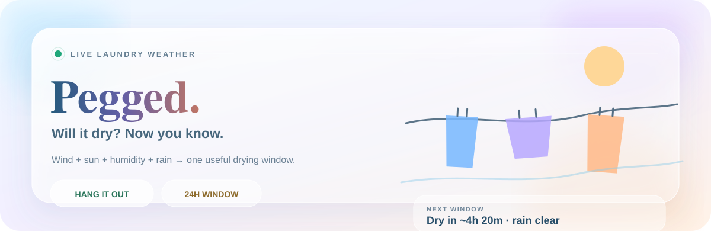
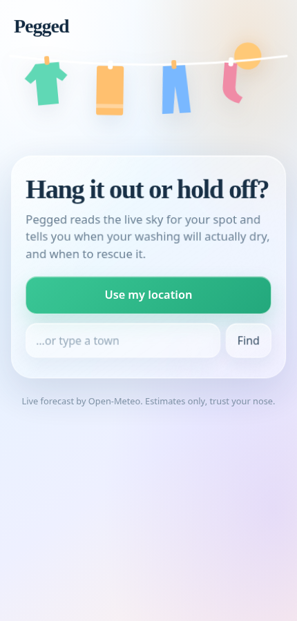
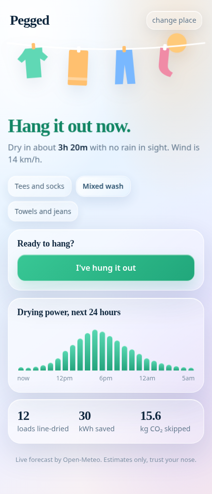
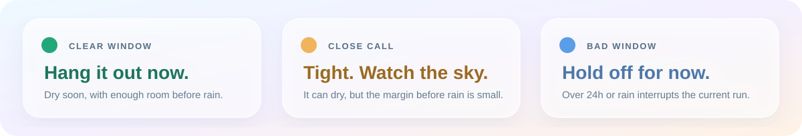

<p align="center">
  
</p>

<p align="center">
  
  
  
  
</p>

<h1 align="center">Laundry weather, without the weather-app homework.</h1>

<p align="center">
  <strong>Pegged</strong> turns the forecast into one useful answer:<br/>
  <strong>hang it out now, keep an eye on it, or hold off.</strong>
</p>

<p align="center">
  It estimates how long your actual load should take to dry, watches for rain before it finishes,<br/>
  and finds the next better window when the current one is a bad bet.
</p>

<p align="center">
  &nbsp;&nbsp;&nbsp;
  
</p>

---

## The call

<p align="center">
  
</p>

Pegged is deliberately opinionated about the **window**, not just the weather.

| Verdict | What it means |
| --- | --- |
| **Hang it out now.** | The selected load is expected to dry within 24 hours and has enough room before forecast rain. |
| **Tight. Watch the sky.** | The load can finish within 24 hours, but rain is close enough that you should stay alert. |
| **Hold off for now.** | The current estimate exceeds 24 hours. Pegged searches forward for the next sub-24-hour window. |
| **Not now.** | Rain or weak drying conditions make the current run unsuitable. |

That **24-hour ceiling is dynamic**: Pegged will not recommend hanging a load simply because it might eventually dry a day and a half later.

## What it reads

| Signal | How Pegged uses it | What you get |
| --- | --- | --- |
| Temperature + humidity | Calculates vapour-pressure deficit — the air's capacity to pull moisture from fabric | Faster/slower drying estimate |
| Wind speed | Boosts evaporation and drives the live clothesline motion | Drying-power lift + visual wind feedback |
| Solar radiation | Adds daytime drying power | Better sunny-window estimates |
| Rain probability + precipitation | A ≥50% rain chance or measurable rain breaks the clean drying run | Rain-aware verdict + rescue warning |
| Day / night | Night still counts, but at only 25% of daytime contribution | More realistic overnight estimates |
| Load size | Tees & socks / mixed wash / towels & jeans use different drying targets | Estimate matched to what you actually hung |

The forecast comes from **[Open-Meteo](https://open-meteo.com/)**. There is no app server and no API key to provision.

## The drying model

Pegged turns each forecast hour into a small amount of **drying power**.

```text
VPD = saturation_vapour_pressure × (1 - relative_humidity)

hourly_power =
  (VPD × (1 + wind_km_h / 15) + solar_radiation / 600)
  × 0.72
  × (daylight ? 1 : 0.25)
```

Rainy hours contribute zero. Pegged accumulates the hourly power until it reaches the selected load target:

```text
Tees & socks     4 points
Mixed wash       8 points
Towels & jeans  14 points
```

The result is an **estimate**, not a fabric-science lab measurement — shade, fabric thickness, spin speed, line spacing and local shelter can all move the real result around.

## Rain rescue

Tap **I've hung it out** and Pegged switches from planning to watching.

It remembers when your washing should be ready and compares that finish time with incoming rain. If rain is due first, the app surfaces a **bring-it-in warning** instead of quietly leaving the optimistic estimate on screen.

Because the line state is stored locally, refreshing or reopening the installed PWA does not immediately forget what is outside.

## Built to move

Pegged is intentionally lively without making the forecast harder to read:

- liquid-glass cards, light sky/lilac/peach gradients and soft depth;
- weather-reactive laundry sway;
- kinetic verdict text and staggered forecast bars;
- drifting glass bubbles and ambient background motion;
- pointer-reactive 3D depth on capable desktops;
- tap ripples and small particle bursts for important actions;
- `prefers-reduced-motion` support when the operating system asks for less motion.

## One app, every screen

<p align="center">
  
</p>

Pegged does more than shrink a phone column on desktop. It adapts its composition and motion budget to the device:

| Environment | Behaviour |
| --- | --- |
| Compact phone | Focused single-column flow, larger touch targets, reduced pointer effects |
| Tablet / foldable | Intermediate grid that reflows on rotation or split-screen resize |
| Desktop | Wide dashboard with the animated weather scene beside the forecast |
| Ultrawide | Multi-column cards use the available space instead of floating in the centre |
| Coarse pointer / touch | Hover-only effects are disabled |
| Lower-power hardware | Expensive ambient effects are reduced automatically |
| Reduced motion / forced colours / high contrast | Accessibility fallbacks take precedence over decoration |

It also accounts for safe-area insets and standalone PWA mode, and falls back cleanly when `backdrop-filter` is unavailable.

## Small habit, visible payoff

Pegged keeps a lightweight local score after you mark a load dry:

- loads line-dried;
- estimated kWh avoided;
- estimated CO₂ skipped.

It is deliberately a nudge, not an account system: the counters live in `localStorage` alongside your selected place, load size and current line state.

## Run it locally

Pegged is plain static HTML/CSS/JavaScript. There is **no build step**.

A service worker will not register from `file://`, so serve the directory locally:

```bash
python3 -m http.server 8080
```

Then open:

```text
http://localhost:8080
```

Use **Use my location** or type a town. Once the app has fetched a forecast, the last response is cached so an offline reopen can still show something useful.

## Ship it on GitHub Pages

1. Push the contents of this folder to your repository's default branch.
2. Open **Settings → Pages**.
3. Choose **Deploy from a branch** and select the repository root.
4. Open the HTTPS Pages URL.
5. Install Pegged from the browser or add it to the home screen.

HTTPS matters for production geolocation and PWA behaviour.

## Files

```text
index.html              app, styles, drying model and interactions
manifest.webmanifest    install metadata, theme and app icons
sw.js                   offline cache
icon.svg                scalable app icon
icon-180.png            Apple touch icon
icon-192.png            PWA icon
icon-512.png            large / maskable PWA icon
banner.svg              in-app/shareable Pegged banner
assets/                 README artwork and screenshots
README.md               you are here
```

## Privacy & architecture

There is no Pegged backend. Forecast and geocoding requests go directly from the browser to Open-Meteo. App preferences and the washing-line state are stored on the device with `localStorage`.

If you choose **Use my location**, the browser asks for geolocation permission; alternatively, you can search by town instead.

---

<p align="center">
  <strong>Check the sky. Peg the load. Beat the rain.</strong><br/>
  <sub>Built for anyone who has ever rewashed a towel because it spent the night outside.</sub>
</p>
